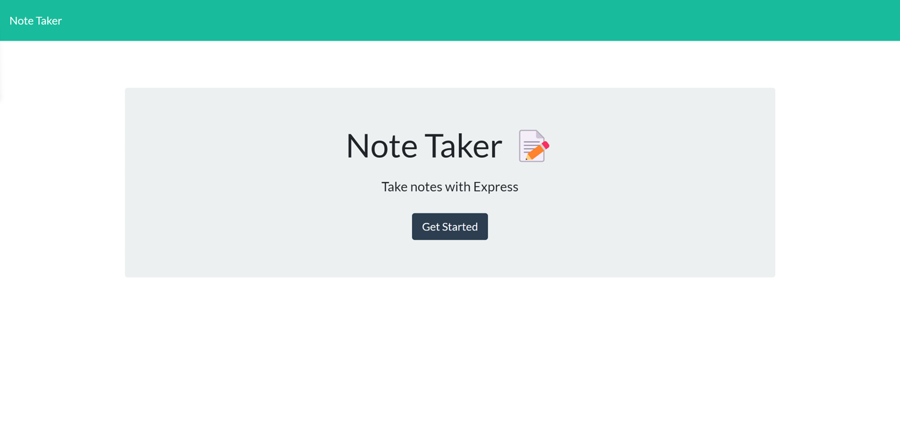
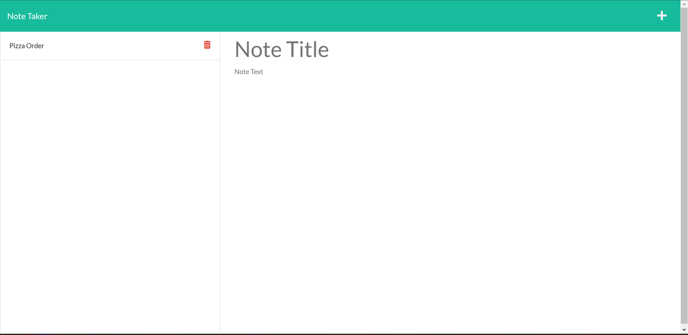
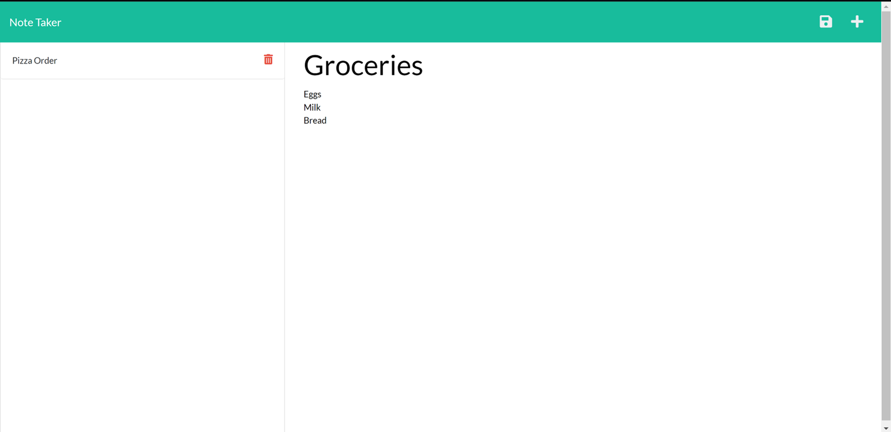
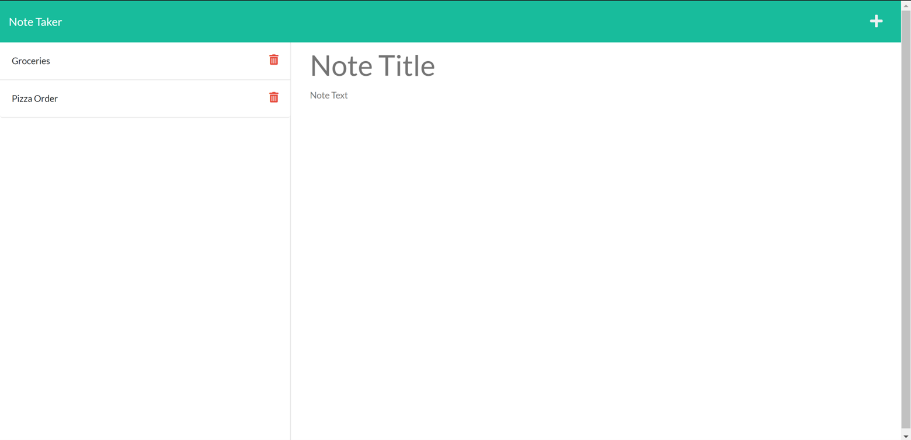
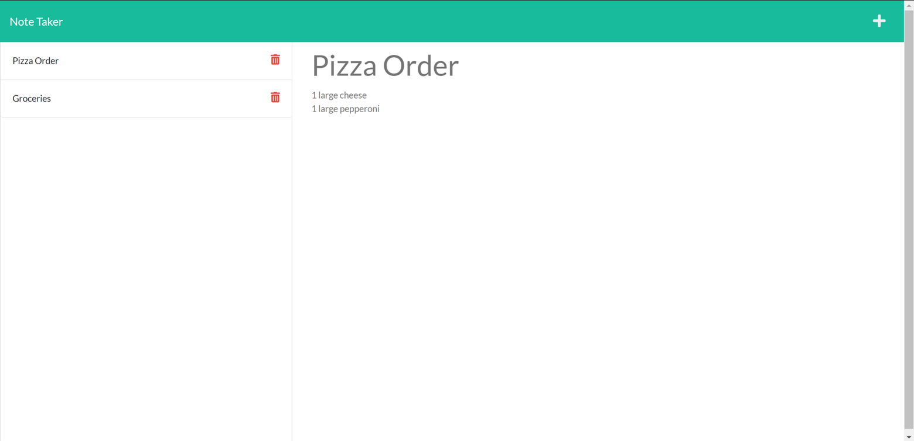

# noteTaker
## Installation
After installed the code, the neccesary dependencies must be installed. The dependencies are included in the package.json file. They include: express, fs, and generate-unique-id.

## Usage
After installing all necesarry dependencies, the app can be run in node using the server.js file. When the app starts up, the user is greeted by a screen introducing the app "Note Taker". A button labeled 'Get Started' is also presented to the user. Once the user has clicked this button, they are presented with a page where any previously saved notes are presented on the left and a blank note form is presented on the right. Once the user has entered text in both the 'note title', and 'note text' fields, the save icon will appear in the navigation bar along the top of the screen. When selected, the user's note is saved and displayed alongside any previously saved notes on the left of the screen. A new blank note is also displayed on the right of the screen. the user can also press the white plus in the top right corner of the screen at any time to open a new note. The user can also select any note from the left side of the screen and view it's contents on the right side of the screen. The user can also choose to delete any note displayed on the left side of the screen at any time but clicking on the delete icon.

